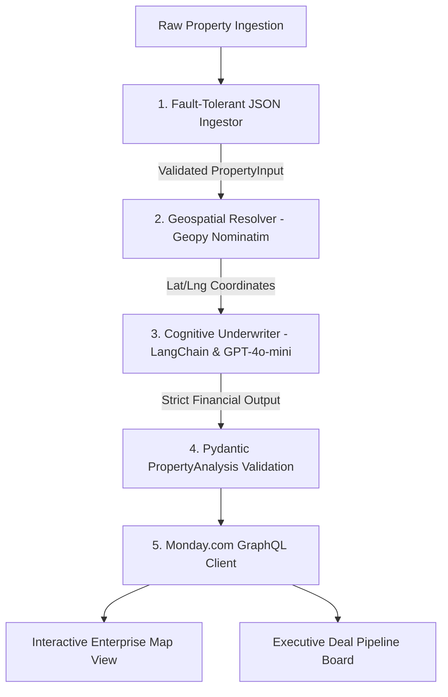

# 🏢 AI Real Estate Pipeline — Enterprise Underwriting & GIS Intelligence

[](https://github.com/jraphaelbarbosa/AI_Real_Estate_Pipeline)


> **[ 🇧🇷 Ler em Português ](README.pt-br.md)**

> **Executive Overview:** The **AI Real Estate Pipeline** is an enterprise autonomous agent built for high-volume commercial and residential property underwriting. The platform automates data ingestion, geospatial location intelligence (Nominatim/Geopy), strict financial viability scoring, and synchronized dashboard dispatch into **Monday.com Enterprise Work OS** with interactive GIS Map Views.

---

## 🏗️ 1. System Architecture & Data Flow



---

## 🛡️ 2. Enterprise Reliability & Design Decisions

### ⚡ Graceful Degradation & Mock Fallback
* If external LLM endpoints experience rate limiting (`RateLimitError`) or connection timeouts, the system automatically degrades into deterministic heuristic evaluation mode (`mock_mode`), preventing batch ingestion stops.
* The test suite runs with **100% deterministic mocks** without requiring live OpenAI API keys or incurring token spend.

### 📐 Strict Financial Invariants (Pydantic v2)
* Financial models enforce strict valuation bounds:
  * **ARV (After Repair Value):** Enforced multiplier rules against purchase prices.
  * **Renovation Estimation:** Parametric ratio checking against historical submarket baselines.
  * **Viability Scoring:** Bounded integer metrics (`0 <= score <= 100`) coupled with explicit action enumerations (`BUY`, `PASS`, `INVESTIGATE`).

### 🗺️ GIS Location Intelligence
* Automatically geocodes arbitrary address strings into precise latitude/longitude pairs, formatting GraphQL payloads specifically for Monday.com's native interactive map views.

---

## 🧪 3. Automated Testing & CI Quality Gate

The pipeline includes a unit test suite covering schema validation, fault tolerance, analyzer mock mode, and Monday GraphQL payload construction.

```bash
# Run test suite with coverage
pytest tests/ -v --cov=src

# Run linter
ruff check src/ tests/
```

---

## 🚀 4. Quickstart & Local Execution

### Prerequisites
* Python 3.11+
* OpenAI API Key (optional for mock mode)
* Monday.com API Key (optional for dry-run mode)

### Setup
```bash
# 1. Clone repository
git clone https://github.com/jraphaelbarbosa/AI_Real_Estate_Pipeline.git
cd AI_Real_Estate_Pipeline

# 2. Setup virtual environment
python -m venv venv
source venv/bin/activate  # Windows: venv\Scripts\activate

# 3. Install dependencies
pip install -r requirements.txt

# 4. Execute pipeline
python -m src.main
```

---

## 📂 5. Canonical Repository Structure

```text
AI_Real_Estate_Pipeline/
├── .github/
│   └── workflows/
│       └── ci.yml                     # Automated CI Quality Gate (ruff + pytest)
├── data/
│   └── raw_mock_data.json             # Property dataset fixture
├── src/
│   ├── config.py                      # Environment configuration
│   ├── main.py                        # Pipeline entrypoint
│   ├── domain/
│   │   └── schemas.py                 # Pydantic v2 Strict Data Contracts
│   ├── services/
│   │   ├── ingestor.py                # Fault-tolerant JSON file ingestion
│   │   ├── analyzer.py                # LangChain & OpenAI Underwriter
│   │   └── monday.py                  # Monday.com GraphQL Client
│   └── utils/
│       ├── geocoder.py                # Geopy Nominatim Location Resolver
│       └── logger.py                  # Structured logging module
├── tests/
│   ├── conftest.py                    # Pytest Global Fixtures
│   └── unit/
│       ├── test_domain_schemas.py     # Pydantic contract tests
│       ├── test_ingestor.py           # Ingestion fault tolerance tests
│       ├── test_analyzer.py           # Underwriter & fallback tests
│       └── test_monday.py             # Monday.com GraphQL mock tests
├── requirements.txt                   # Production & testing dependencies
└── README.md                          # Technical platform documentation
```
